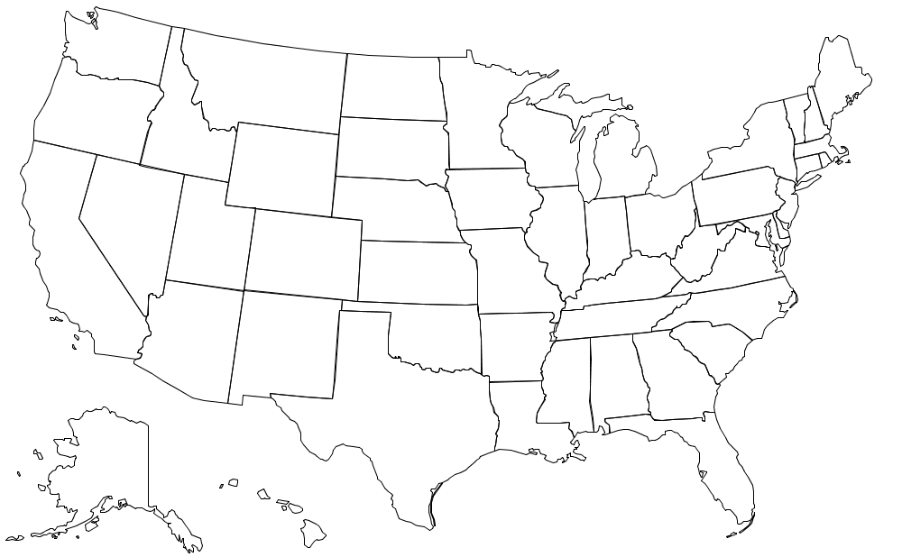
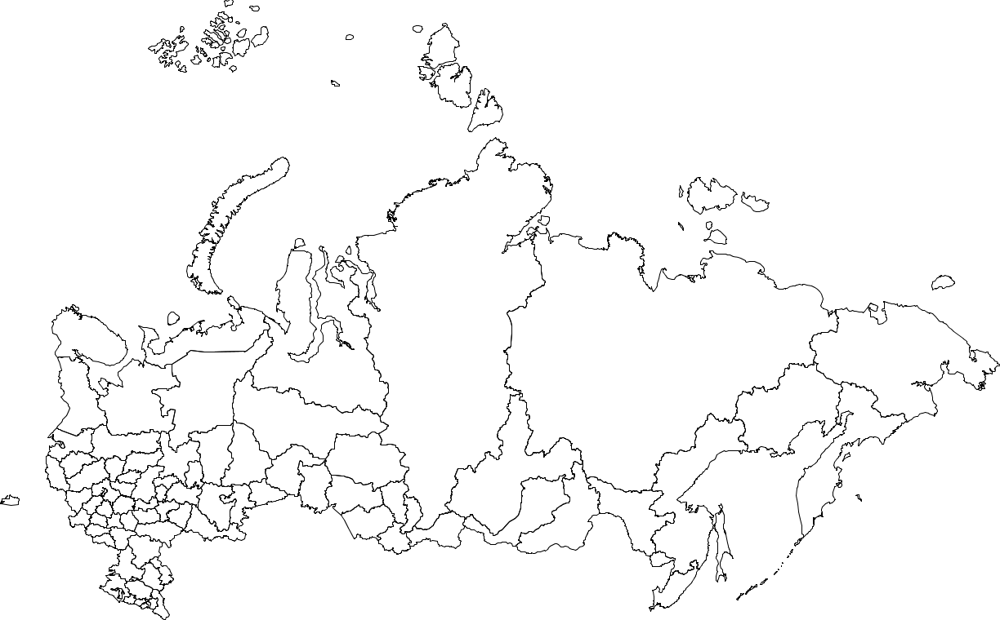

# World map visualized

USA Map Example

<blockquote>

</blockquote>


A Java program that renders geographic boundaries from standardized input data to visual maps.

## **Input Format Specification**
```
<width> <height>
<region_name_1>
<vertex_count_1>
<x1> <y1>
<x2> <y2>
...
<region_name_N>
<vertex_count_N>
...
```

## **Usage**
1. **Compile** the program:
   ```bash
   javac WorldMap.java
   ```
2. **Run** with input file:
   ```bash
   java WorldMap < input.txt
   ```
   


## **Implementation Details**
- Sets canvas size exactly to input dimensions
- Implements proper coordinate scaling:
  ```java
  StdDraw.setXscale(0, width);
  StdDraw.setYscale(0, height);
  ```
- Processes polygons sequentially using `StdDraw.polygon()`
- Handles variable-length input sections per region

## **Visual Properties**
- Maintains exact input proportions
- Black boundary lines by default
- White fill for polygons
- Clean anti-aliased rendering

## Examples:

<blockquote>
<pre class = "terminal">
<span class = prompt>~/Desktop/io&gt;</span> <span class = command>javac-introcs WorldMap.java</span>

<span class = prompt>~/Desktop/io&gt;</span> <span class = command>java-introcs WorldMap < usa.txt</span>


<span class = prompt>~/Desktop/io&gt;</span> <span class = command>java-introcs WorldMap < russia.txt</span>




<span class = prompt>~/Desktop/io&gt;</span> <span class = command>java-introcs WorldMap < world.txt</span>


</pre>
</blockquote>

## **Applications**
- Geographic information systems
- Educational tools
- Data visualization pipelines
- Cartographic applications
